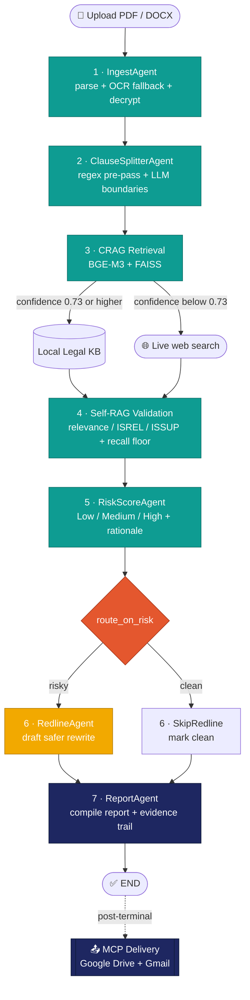

<div align="center">

# 🛡️ ContractSentinel

### AI Contract-Risk Analyzer — powered by a local-first LangGraph agent

*Upload a contract → get every risky clause found, scored, and rewritten — without your data ever leaving the machine.*

<br/>

[](https://www.python.org/)
[](https://fastapi.tiangolo.com/)
[](https://langchain-ai.github.io/langgraph/)
[](https://nextjs.org/)
[](https://www.typescriptlang.org/)
[](https://tailwindcss.com/)
[](https://ollama.com/)
[](#-testing)
[](#-project-status)
[](#-why-local-first)

</div>

---

## 📌 Overview

**ContractSentinel** is an autonomous, AI-powered system that reads a legal contract and tells you where the risk is. A user uploads a **PDF or DOCX**; a fixed **7-node [LangGraph](https://langchain-ai.github.io/langgraph/) pipeline** splits it into clauses, retrieves supporting legal evidence for each one, validates which clauses are *genuinely* worth flagging, scores each **Low / Medium / High** with a written rationale, drafts a **safer rewrite** for the risky ones, and compiles a **branded PDF report** — which is delivered to the user's own Google Drive and emailed to them.

The whole analysis runs **locally**. Both the generative model (**Qwen3:8b**) and the embedding model (**BGE-M3**) are served through a local [Ollama](https://ollama.com/) runtime, so confidential contract text **never leaves the machine** — a direct answer to the privacy problem that keeps most organisations from putting their contracts into cloud AI tools.

It behaves like a real multi-tenant SaaS — landing page, authentication, per-user data isolation, per-user Drive, live progress streaming — while running entirely on a local box.

---

## 📖 Table of Contents

- [Highlights](#-highlights)
- [Why Local-First](#-why-local-first)
- [Architecture](#-architecture)
- [The 7-Node Pipeline](#-the-7-node-pipeline)
- [Tech Stack](#-tech-stack)
- [Project Structure](#-project-structure)
- [Getting Started](#-getting-started)
- [Running the App](#-running-the-app)
- [Testing](#-testing)
- [Security](#-security)
- [Development Methodology](#-development-methodology)
- [Project Status](#-project-status)
- [Team](#-team)
- [License](#-license)

---

## ✨ Highlights

| | |
|---|---|
| 🧠 **Agentic pipeline** | A fixed 7-node LangGraph state machine with exactly 2 conditional edges — ingest → split → retrieve → validate → score → redline → report. |
| 🔎 **Corrective RAG (CRAG)** | Per-clause retrieval over a local **FAISS** knowledge base of **1,400+ real contract clauses** (Bonterms + **CUAD**, CC BY 4.0) across 39 clause types, with an automatic **live web-search fallback** when confidence drops below `0.73`. |
| ✅ **Self-RAG validation** | Relevance / support checks discard false alarms; a **recall floor** protects genuinely high-risk clause types from being dropped. Accuracy is measured by an offline harness reporting precision / recall / F1 **per clause type, each with a 95% bootstrap confidence interval** — numbers are best-effort-labeled, not lawyer-reviewed. |
| ✍️ **Automatic redlining** | High-risk clauses get a suggested safer rewrite plus a rationale. |
| 🔒 **Private by construction** | 100% local inference; uploaded contracts **encrypted at rest** (Fernet). |
| 🛡️ **Production-grade security** | bcrypt + JWT auth, session hardening, rate-limiting + lockout, prompt-injection defense, security headers, upload magic-byte validation. |
| ♻️ **Durable & resumable** | SQLite job store + LangGraph checkpointer — a killed job **resumes from the last completed node**. |
| 📡 **Live progress** | Watch the pipeline advance node-by-node over **Server-Sent Events**. |
| 📤 **Real delivery** | Branded PDF report pushed to the user's **Google Drive** + emailed via **Gmail** (MCP). |
| 🧪 **Rigorously tested** | **933** backend tests, **242** frontend tests, built spec-first with TDD. |

---

## 🔐 Why Local-First

> Contracts are among the most confidential documents a business handles. Sending them to a hosted LLM means the document leaves your control — often permanently.

ContractSentinel runs **every model locally** through Ollama:

- **Qwen3:8b** — generative reasoning (clause splitting, validation, scoring, redlining)
- **BGE-M3** — embeddings for retrieval

These are kept as **strictly separate model objects** (the embedding model is never substituted for the generative one). No contract text, clause, or piece of evidence is ever sent to a third-party API. Uploaded files are additionally **encrypted at rest** with Fernet (AES-128-CBC + HMAC-SHA256).

---

## 🏗️ Architecture

A **LangGraph `StateGraph`** with exactly **7 sequential nodes** and exactly **2 conditional edges**. This shape is fixed by the project [constitution](specs/000-constitution.md) and treated as immutable — every feature is built *around* the graph, never by adding nodes.



**The two conditional edges** (every other transition is a plain linear edge):
1. **CRAG confidence routing** — local FAISS KB vs. live web fallback, merged per clause.
2. **`route_on_risk`** — RedlineAgent vs. SkipRedline.

---

## 🧩 The 7-Node Pipeline

| # | Node | What it does |
|:-:|------|--------------|
| **1** | **IngestAgent** | Parses PDF/DOCX (PyMuPDF / python-docx), OCR fallback (Tesseract) for scans; decrypts the at-rest-encrypted upload to a temp file before parsing. |
| **2** | **ClauseSplitterAgent** | Regex pre-pass proposes clause boundaries; the LLM refines boundaries and assigns clause **types**; size-gated for large documents. |
| **3** | **CRAG Retrieval** | Embeds each clause (BGE-M3), searches a local **FAISS** legal KB, scores confidence; `< 0.73` → **live web fallback**. Evidence merged per clause. |
| **4** | **Self-RAG Validation** | Relevance / ISREL / ISSUP checks discard weak flags; a **recall floor** protects genuinely high-risk clause types from being dropped. |
| **5** | **RiskScoreAgent** | Assigns **Low / Medium / High** with a written rationale (deterministic, temperature-pinned). |
| **6** | **route_on_risk → Redline / Skip** | Risky clauses get a safer rewrite; clean clauses are marked and skipped. |
| **7** | **ReportAgent** | Assembles the final report + full evidence trail; rendered to a branded PDF. |

Every clause that survives validation ends up scored:

🔴 **HIGH** — serious exposure, needs a rewrite &nbsp;·&nbsp; 🟡 **MEDIUM** — worth review/negotiation &nbsp;·&nbsp; 🟢 **LOW** — acceptable, standard wording

---

## 🛠️ Tech Stack

<table>
<tr><td><b>Orchestration</b></td><td>LangGraph · langgraph-checkpoint-sqlite · langchain-core</td></tr>
<tr><td><b>LLM & Embeddings</b></td><td>Ollama · Qwen3:8b (generative) · BGE-M3 (embeddings)</td></tr>
<tr><td><b>Retrieval</b></td><td>FAISS · NumPy · DuckDuckGo Search (web fallback)</td></tr>
<tr><td><b>Document Parsing</b></td><td>PyMuPDF · python-docx · Tesseract OCR</td></tr>
<tr><td><b>API & Data</b></td><td>FastAPI · SSE (sse-starlette) · SQLite · Alembic · Pydantic v2</td></tr>
<tr><td><b>Security & Delivery</b></td><td>cryptography (Fernet) · passlib/bcrypt · PyJWT · MCP SDK · reportlab · Google API client</td></tr>
<tr><td><b>Frontend</b></td><td>Next.js 14 · TypeScript · Tailwind CSS · Recharts · lucide-react</td></tr>
<tr><td><b>Testing</b></td><td>pytest (+asyncio, cov, mock) · Vitest · Testing Library</td></tr>
</table>

---

## 📂 Project Structure

```
ContractSentinel/
├── backend/
│   ├── app/
│   │   ├── graph/            # LangGraph StateGraph + the 7 nodes
│   │   │   └── nodes/        # ingest, splitter, crag, self-rag, risk, redline, report
│   │   ├── rag/              # embeddings, FAISS KB, web retriever
│   │   ├── llm/              # Ollama clients + prompt-injection guard
│   │   ├── api/              # FastAPI app, routes, auth, rate-limit, SSE
│   │   ├── runner/           # pipeline runner + job orchestration
│   │   ├── delivery/         # MCP Drive/Gmail, PDF/email rendering
│   │   ├── security/         # Fernet crypto seam
│   │   ├── models/           # Pydantic + TypedDict state schema
│   │   └── db/               # SQLite store + Alembic migrations
│   └── pyproject.toml
├── frontend/
│   └── src/
│       ├── app/              # Next.js routes (landing, login, upload, dashboard, …)
│       ├── components/       # UI, charts, report, dashboard, marketing, …
│       └── lib/api/          # provider seam (real ↔ mock)
├── specs/                    # spec-driven workflow: constitution + per-feature specs
├── eval/                     # offline accuracy / variance evaluation harness
├── scripts/                  # OAuth bootstrap, delivery/latency smoke tools
└── docs/
```

---

## 🚀 Getting Started

### Prerequisites

- **Python 3.11**
- **Node.js 18+**
- **[Ollama](https://ollama.com/)** with the models pulled:
  ```bash
  ollama pull qwen3:8b
  ollama pull bge-m3
  ```
  > 💡 On a 6 GB GPU, Qwen3:8b runs at roughly a 70/30 GPU/CPU split — pre-warm it before a run.
- **Tesseract OCR** (only needed for scanned PDFs) — [install guide](https://github.com/tesseract-ocr/tesseract)
- *(Optional, for delivery)* Google OAuth credentials — see [`scripts/oauth_bootstrap.py`](scripts/).

### Installation

```bash
# 1. Clone
git clone <your-repo-url> ContractSentinel
cd ContractSentinel

# 2. Backend
cd backend
python -m venv .venv
.venv/Scripts/activate            # Windows  (source .venv/bin/activate on macOS/Linux)
pip install -e ".[dev,eval]"

# 3. Frontend
cd ../frontend
npm install
```

---

## ▶️ Running the App

**Backend** (port 8000, from `backend/`):

```bash
# apply DB migrations (first run / after pulling)
.venv/Scripts/python.exe -m alembic upgrade head

# start the API  (local HTTP dev → AUTH_COOKIE_SECURE=False; default True requires TLS)
AUTH_COOKIE_SECURE=False .venv/Scripts/python.exe -m uvicorn app.api.main:app --host 127.0.0.1 --port 8000
```

<details>
<summary>PowerShell equivalent</summary>

```powershell
$env:AUTH_COOKIE_SECURE="False"
.venv\Scripts\python.exe -m uvicorn app.api.main:app --host 127.0.0.1 --port 8000
```
</details>

**Frontend** (port 3000, from `frontend/`):

```bash
npm run dev
```

`frontend/.env.local` must contain `NEXT_PUBLIC_API_PROVIDER=real` (proxies to `:8000`). Then open **http://localhost:3000**.

---

## 🧪 Testing

```bash
# Backend  (from backend/)
.venv/Scripts/python.exe -X utf8 -m pytest -q

# Frontend  (from frontend/)
npm run test
```

**933** backend tests · **242** frontend tests — all green. Built spec-first with TDD — tests are written and confirmed failing *before* implementation, and a failing test is fixed by fixing the code, never by weakening the test.

---

## 🛡️ Security

Security was developed as a dedicated hardening phase, not an afterthought:

- **Authentication** — email + password (bcrypt with SHA-256 pre-hash), HS256 JWT in an **httpOnly cookie**, sliding 30-min idle timeout + 8-hour absolute cap.
- **Session invalidation** — server-side `session_epoch` enables *log-out-everywhere*, ends other sessions on password change, invalidates on reset.
- **Brute-force defense** — per-IP rate limiting + persisted per-account lockout.
- **Forgot-password** — emailed, time-limited, single-use link; tokens stored **hashed** (HMAC-SHA256); no email-existence disclosure.
- **Encryption at rest** — Fernet encrypts stored **OAuth tokens** and **uploaded contract files** through one key-management seam.
- **Prompt-injection defense** — untrusted contract/evidence text is fenced in per-call-nonce delimiters inside a `user` message; trusted instructions stay in a `system` message — across all generative LLM calls.
- **Security headers** — `X-Content-Type-Options`, `X-Frame-Options: DENY`, a strict CSP, `Referrer-Policy`, COOP, Permissions-Policy (HSTS available, TLS-gated).
- **Upload hardening** — magic-byte validation rejects files whose content doesn't match their extension (PDF → `%PDF`, DOCX → ZIP).
- **Per-user isolation** — every data read is scoped to the owning account; no cross-account visibility.

---

## 📐 Development Methodology

Every feature follows a strict **spec-driven workflow** defined in [`specs/000-constitution.md`](specs/000-constitution.md):

```
spec.md  →  plan.md  →  tasks.md  →  implementation
   └────────── each gated by a spec-reviewer review before advancing ──────────┘
```

- **No source file** is written until that feature's `spec.md` **and** `plan.md` exist and are approved.
- **Fixed architecture** — the 7-node / 2-edge graph is immutable; scope changes require an explicit written **constitution amendment**.
- **TDD where practical**; **one branch per feature**, fast-forward merged to `main` only when its tests pass.

---

## ✅ Project Status

**ContractSentinel is feature-complete.** The entire stack — the agent pipeline, the API, durable persistence, the full Next.js frontend, security, and delivery — is implemented, integrated, and tested end-to-end.

- [x] **7-node LangGraph pipeline** — ingest → split → CRAG → Self-RAG → score → redline → report
- [x] **FastAPI backend** — live SSE progress + durable, **resumable** SQLite persistence
- [x] **Full Next.js frontend** — landing, auth, upload, live processing, report workspace, dashboard, history, settings, integrations
- [x] **Multi-tenant isolation** + **per-user Google Drive** (per-user OAuth)
- [x] **Security hardening** — encryption at rest, session/auth hardening, rate-limiting + lockout, prompt-injection defense, security headers, upload validation
- [x] **Offline evaluation harness** — per-clause-type precision/recall/F1 with 95% bootstrap confidence intervals — + Self-RAG recall floor
- [x] **Professional PDF report** + branded HTML email + MCP Drive/Gmail delivery
- [x] **Real end-to-end smoke tests passed** on local Qwen3:8b + BGE-M3

### 🔭 Future Enhancements *(optional, beyond current scope)*

- TLS termination at the edge and publishing the Google OAuth app to production
- Encryption at rest for generated reports / parsed text (contract files & OAuth tokens already encrypted)
- Dependency-scan remediation wired into CI
- Expert (lawyer-confirmed) gold labels + the full-corpus accuracy run — the corpus (CUAD, 1,400+ clauses) and the CI-bounded per-type harness are in place; the committed gold labels are heuristic candidates pending human confirmation

---

## 👥 Team

| Name | Role |
|------|------|
| **Yash Joshi** | Backend implementation & agent pipeline |
| **Bansi** | Frontend implementation |

---

## 📄 License

This project is currently developed for academic / educational purposes. No open-source license has been applied yet — all rights reserved by the authors. Please contact the team before reuse.

---

<div align="center">

*Built with LangGraph, FastAPI, Next.js — and a strict spec-driven workflow.*

**⭐ If you find this project interesting, consider giving it a star.**

</div>
